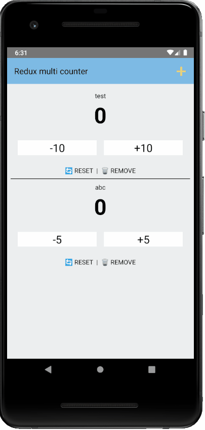

# rn-multi-counter


## 미리 보기



## 설치
``` bash
git clone https://github.com/mnngfl/rn-multi-counter.git
cd rn-multi-counter
```

## 실행
``` bash
# 최초 실행인 경우
npm run android # 혹은 npm run ios
# 최초 실행 이후
npm start
```

## 프로젝트 설명
`redux`를 이용해 여러 개의 카운터를 만들고 관리할 수 있는 애플리케이션입니다.

`redux`의 구성 요소인 `Reducer`를 작성하기 위해 [ducks pattern](https://github.com/erikras/ducks-modular-redux)을 참고하였습니다.

주요 기능은 다음과 같습니다.
- 사용자의 입력을 받아 카운터 생성
- 선택한 카운터 삭제
- count 증가/감소
- count를 원래대로 초기화
